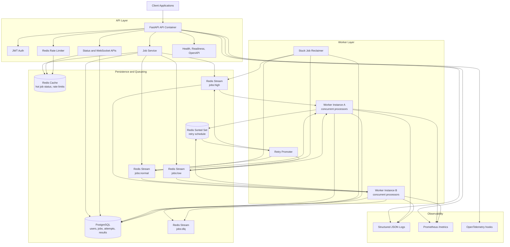

# Distributed Job Processing Platform

A backend-focused asynchronous job platform inspired by Celery, Sidekiq, and Temporal. It uses FastAPI for the API, PostgreSQL for durable metadata, Redis Streams for queueing, Redis for hot status cache and rate limiting, and a separate worker process for concurrent job execution.

## Architecture



The system is split into two deployable runtime roles that share the same codebase and container image:

- `api`: handles authentication, validation, idempotent job submission, status reads, WebSocket status streaming, rate limiting, health checks, OpenAPI, and Prometheus metrics.
- `worker`: consumes Redis Streams through a consumer group, claims jobs in PostgreSQL, executes job processors concurrently, records results, schedules retries, and moves terminal failures to the DLQ.

PostgreSQL is the durable source of truth for job state. Redis Streams provide queue durability and fan-out across multiple worker instances. Redis cache is used only for hot reads and abuse prevention, so losing cached keys does not lose jobs.

## Queue Flow

1. Clients register or log in and submit jobs to `POST /api/v1/jobs`.
2. The API stores the job in PostgreSQL with `queued` status and publishes the job id to a priority Redis Stream.
3. Workers consume through a Redis consumer group, atomically claim the job in PostgreSQL, and mark it `processing`.
4. Successful jobs are marked `completed` with a JSON result.
5. Failed jobs are marked `retrying`, scheduled in a Redis sorted set using exponential backoff, then promoted back to the correct priority stream.
6. Jobs that exceed `max_retries` are marked `failed` and copied to the Redis DLQ stream.

Priority bands are mapped from numeric priority: `1-3` high, `4-7` normal, `8-10` low.

## Reliability Model

Idempotency uses `(user_id, idempotency_key)` so repeated submissions return the existing job instead of duplicating work. Workers use database state as the source of truth and only process jobs they can atomically claim. A background reclaimer finds stale `processing` locks and requeues them, which handles worker crashes and unfinished jobs. Job execution is wrapped with a timeout.

## Worker Lifecycle

Workers create Redis consumer groups on startup, run concurrent job tasks up to `WORKER_CONCURRENCY`, promote due retries, sample queue metrics, and reclaim stale jobs. On `SIGTERM`, the worker stops consuming new jobs and gives active jobs `WORKER_SHUTDOWN_GRACE_SECONDS` to finish.

Scale workers horizontally:

```bash
docker compose up --scale worker=3
```

## Local Setup

```bash
cp .env.example .env
docker compose up --build
```

Swagger/OpenAPI: <http://localhost:8000/docs>

Health endpoints:

```bash
curl http://localhost:8000/health
curl http://localhost:8000/ready
curl http://localhost:8000/metrics
```

## Deploying To Fly.io

This repo includes [fly.toml](fly.toml), configured with two process groups from the same Docker image:

- `api`: public FastAPI service
- `worker`: background Redis Streams consumer

High-level deployment:

```bash
fly auth login
fly apps create your-unique-job-platform-name
fly postgres create --name your-unique-job-platform-db --region bom
fly postgres attach your-unique-job-platform-db --app your-unique-job-platform-name
fly redis create
fly secrets set REDIS_URL="redis://..."
fly secrets set JWT_SECRET="replace-with-a-long-random-secret"
fly deploy
fly scale count api=1 worker=1
```

Then run the SQL migration against the Fly Postgres database:

```bash
fly ssh console -C "psql \$DATABASE_URL -f migrations/001_init.sql"
```

See [scripts/fly_deploy.md](scripts/fly_deploy.md) for the full Fly runbook, including Windows secret generation and scaling workers.

## Example API Calls

```bash
TOKEN=$(curl -s -X POST http://localhost:8000/api/v1/auth/register \
  -H "Content-Type: application/json" \
  -d '{"email":"demo@example.com","password":"password123"}' | jq -r .access_token)

curl -X POST http://localhost:8000/api/v1/jobs \
  -H "Authorization: Bearer $TOKEN" \
  -H "Content-Type: application/json" \
  -d '{
    "job_type": "pdf_processing",
    "payload": {"pages": 24, "duration": 1},
    "priority": 1,
    "max_retries": 3,
    "idempotency_key": "customer-123-report-2026-05-24"
  }'

curl http://localhost:8000/api/v1/jobs/<job-id> \
  -H "Authorization: Bearer $TOKEN"

curl http://localhost:8000/api/v1/admin/stats \
  -H "Authorization: Bearer $TOKEN"
```

Seed demo jobs:

```bash
python scripts/seed_jobs.py
```

Run a lightweight load test:

```bash
python scripts/load_test.py --jobs 500 --concurrency 50
```

## Status Values

`queued`, `processing`, `completed`, `failed`, `retrying`.

## Production Notes

Use a real secret manager for `JWT_SECRET`, managed Postgres/Redis with backups, Redis AOF enabled, TLS between services, and separate Prometheus/Grafana scraping for `/metrics`. The API and worker images are the same build artifact with different commands, which keeps deployments simple for Kubernetes, ECS, or Nomad.
